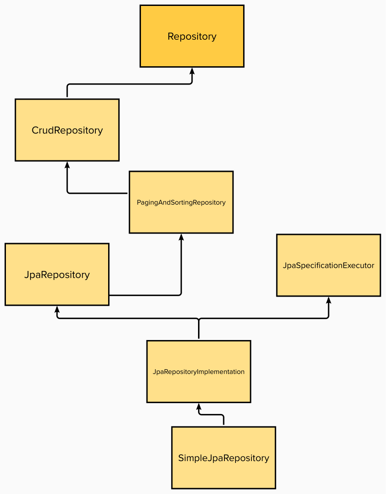

 

# Anotasi
- @mappedSuperClass : Kelas tidak akan dipetakan secara langsung ke tabel database & menyediakan attribute & method yang dapat dipakai kelas-kelas lain.
- @noRepositoryBean : Menandakan kelas agar tidak diperlakukans sbg repository tp sebagai superclass (bean tidak dibuat)
- @RepositoryDefinition == extends Repository
- @EnableJpaRepository untuk ?